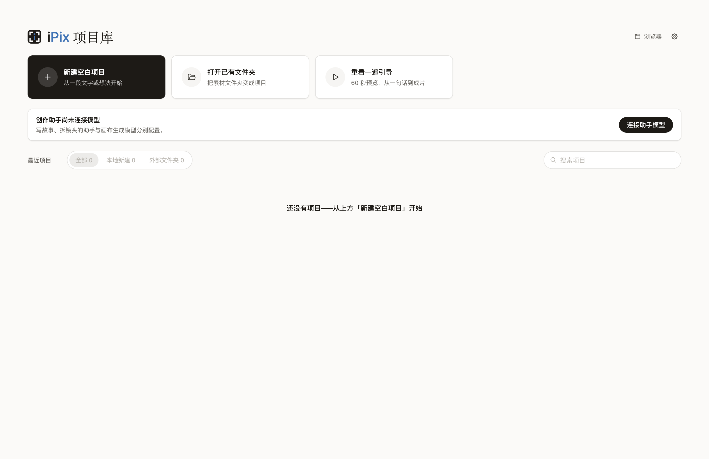
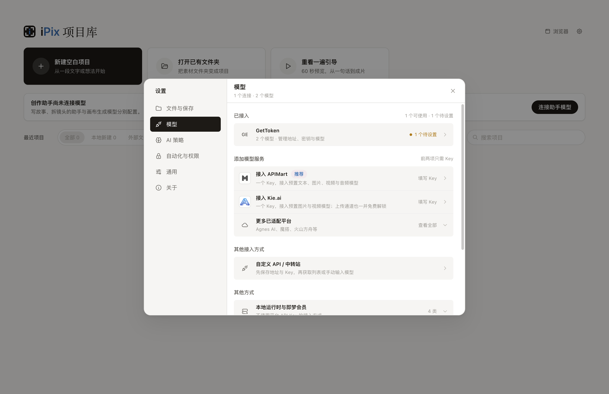

# iPix 零基础使用教程

> 适用版本：`v0.21.0-gettoken.5`<br>
> 目标：从安装开始，完成第一张图片、第一次参考图改图，以及第一段 Seedance 2.0 视频。

你不需要安装 Docker、数据库或开发工具。iPix 是本地桌面应用，项目、提示词和 API Key 都保存在自己的电脑上；真正生成图片和视频时，会消耗你在 GetToken 等模型服务商的余额。

## 1. 下载并安装

当前测试版提供两个安装包：

| 系统 | 安装包 |
|---|---|
| macOS Apple Silicon（M1/M2/M3/M4） | [iPix.Preview-mac-arm64.dmg](https://github.com/marswon/iPix/releases/download/v0.21.0-gettoken.5/iPix.Preview-mac-arm64.dmg) |
| Windows 10/11 x64 | [iPix.Preview-win-x64.exe](https://github.com/marswon/iPix/releases/download/v0.21.0-gettoken.5/iPix.Preview-win-x64.exe) |

完整发布页：[v0.21.0-gettoken.5](https://github.com/marswon/iPix/releases/tag/v0.21.0-gettoken.5)

### macOS

1. 打开 DMG，把 `iPix Preview.app` 拖入“应用程序”。
2. 第一次启动如果被拦截，在 Finder 中右键应用，选择“打开”。
3. 仍提示“已损坏”时，确认安装包来自上面的发布页，再运行：

```bash
xattr -dr com.apple.quarantine "/Applications/iPix Preview.app"
```

### Windows

运行 EXE。若 SmartScreen 拦截，选择“更多信息”→“仍要运行”。

从旧版升级时，先退出并删除旧的 `Nomi Preview`。iPix 会继续读取原来的设置、凭据和 `Nomi Preview Projects`，不用迁移项目。

## 2. 新建第一个项目

打开 iPix 后，点击 **新建空白项目**。项目库还提供“打开已有文件夹”，适合把现成素材目录直接作为项目使用。



默认项目保存在文档目录下的 `Nomi Projects` 或 `Nomi Preview Projects`。目录名暂时保留，是为了兼容旧项目。

## 3. 接入 GetToken

准备好 GetToken API Key 后：

1. 点击右上角齿轮，进入 **设置 → 模型**。
2. 点击 **自定义 API / 中转站**。
3. 名称填写 `GetToken`。
4. Base URL 填写 `https://www.gettoken.net`。不要添加其他路径。
5. 鉴权方式选择 Bearer/API Key，并粘贴 Key。
6. 获取模型列表，或手动添加需要的模型。

新手建议先添加：

| 用途 | 模型 |
|---|---|
| 文生图 | `qwen-image-2.0` |
| 参考图改图 | `qwen-image-2.0-pro` |
| 视频 | GetToken 列表中的 Seedance 2.0 模型 |
| 文本助手 | 你账户中可用的文本模型，例如 Qwen 或 DeepSeek |



看到连接和模型数量，说明配置已经保存。验证状态只代表请求契约可用；余额不足、限流或上游维护仍可能让单次任务失败。

## 4. 生成第一张图片

1. 打开项目顶部的 **生成**。
2. 点击画布工具栏的图片图标，添加图片节点。
3. 选择 **文生图**。
4. 模型选择 `Qwen Image 2.0` 或 `Qwen Image 2.0 Pro`。
5. 选择比例与清晰度，第一次建议 `1:1`、`1K`、生成 1 张。
6. 输入提示词并点击生成。

可以直接试这条提示词：

```text
一只透明绿色玻璃花瓶放在白色木桌上，柔和自然侧光，干净的产品摄影，背景简洁，真实材质，方形构图
```

任务提交后，可在右上角 **任务** 中查看排队、运行和完成状态。满意的结果可以拖到画布继续使用，也可以加入时间轴。

## 5. 用参考图改图

`qwen-image-2.0-pro` 支持参考图编辑。正确步骤是：

1. 新建或选中图片节点，切换到 **改图**。
2. 把本地图片拖入“输入图/参考图”区域，也可以连接画布里已有的图片节点。
3. 模型选择 `Qwen Image 2.0 Pro`。
4. 描述“保留什么、改变什么”。
5. 第一次建议 `1:1`、`1K`、生成 1 张，然后点击生成。

示例：

```text
保留人物、服装、姿势和原有构图，只把背景改成傍晚的海边，天空呈柔和粉色，光线方向与人物一致，保持写实摄影质感
```

写改图提示词时，不要只写“更好看”。清楚列出不变项和变化项，模型更不容易把人物、构图或服装一起改掉。

## 6. 生成 Seedance 2.0 视频

### 文字生成视频

1. 在生成画布添加视频节点。
2. 选择 **文生视频** 和 GetToken 的 Seedance 2.0 模型。
3. 第一次使用建议选择 5 秒、720p。
4. 提示词写清楚主体动作、镜头运动和环境变化。

示例：

```text
镜头缓慢向前推进，女孩站在海边轻轻回头，头发被微风吹动，远处海浪自然起伏，电影感自然光，人物身份和服装保持稳定
```

### 图片生成视频

1. 把满意的图片节点连接到视频节点，作为首帧/参考图。
2. 切换到 **图生视频**。
3. 选择 Seedance 2.0，并设置时长、分辨率和比例。
4. 提示词重点描述运动，不要重复堆叠外观形容词。


视频任务通常比图片耗时长。不要重复点击生成；先到右上角 **任务** 查看是否仍在排队或轮询。

## 7. 放入时间轴并导出

1. 选中满意的视频结果，添加到时间轴。
2. 拖动片段调整顺序，裁掉不需要的开头或结尾。
3. 在 **预览** 中完整播放一次。
4. 点击导出，选择输出位置，生成 MP4。


## 8. 常见问题

### 连接显示不可用

确认 Base URL 是 `https://www.gettoken.net`，Key 没有多余空格，并检查 GetToken 账户余额。不要把后台页面地址或模型路径填进 Base URL。

### Qwen 改图提示尺寸错误

请使用 `v0.21.0-gettoken.5` 或更高版本。该版本会把 `1:1 + 1K` 转换成上游要求的像素尺寸。

### 生成成功但看不到图片

先打开右上角 **任务** 查看任务状态。若旧任务仍显示成功但没有素材，重新启动 iPix，让启动修复更新旧的 GetToken Qwen Pro 映射，再提交一次新任务。

### Seedance 一直在排队

视频生成需要持续轮询。保持 iPix 运行，先查看任务中心，不要连续重复提交。若长时间没有进展，再到 GetToken 后台核对任务和余额。

### AI 助手不能写故事或拆镜头

图片和视频模型不能代替文本模型。回到 **设置 → 模型**，确认至少有一个可用的文本模型。

## 9. 数据与安全

- API Key 使用系统安全存储；不要把完整 Key 发到群聊或截图里。
- iPix 项目和素材默认保存在本机。
- 删除 App 不等于删除项目目录。
- 本教程截图不包含真实 Key、签名素材 URL、账户信息或供应商任务 ID。
